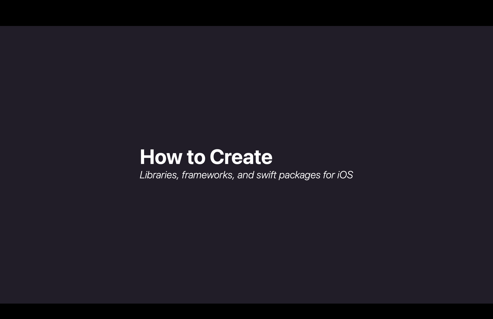
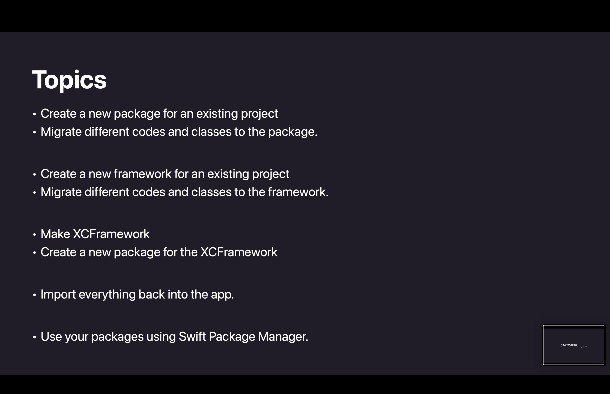
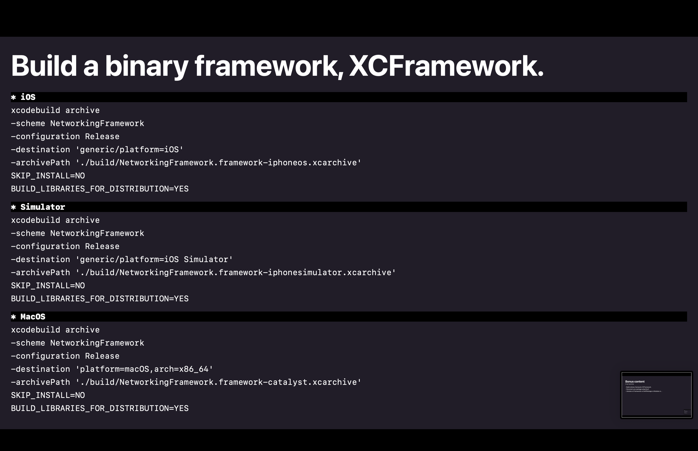
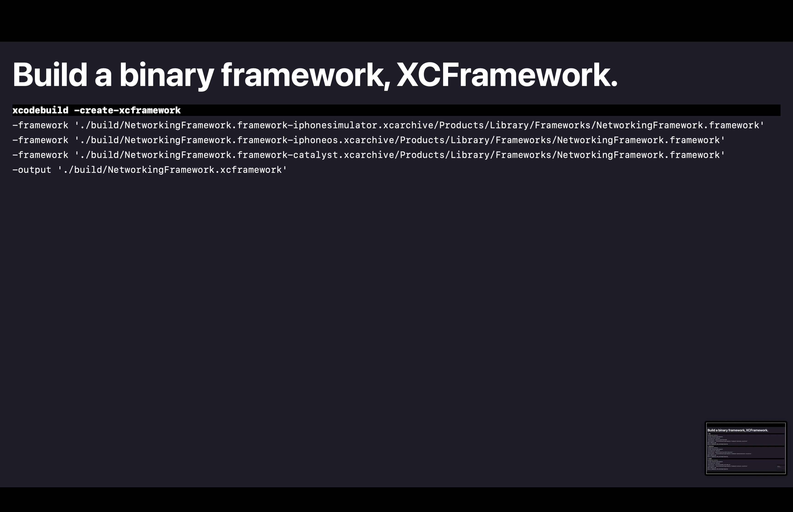
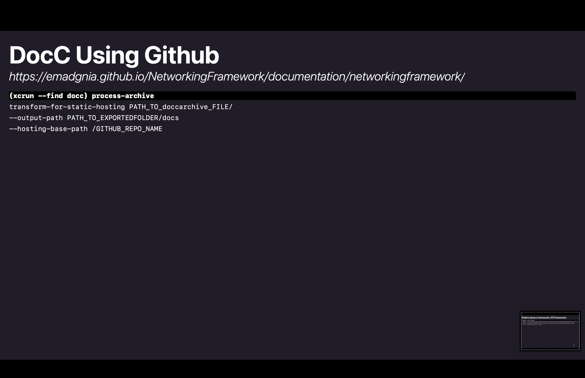
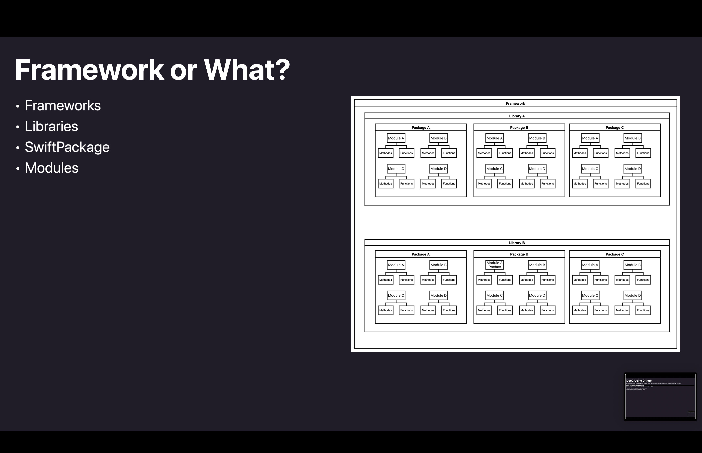

# workshop-material

## Resources

- [StarCharles](https://github.com/Emadgnia/StarCharles)
- [ModelPackage](https://github.com/Emadgnia/ModelPackage)
- [NetworkingFramework](https://github.com/Emadgnia/NetworkingFramework)
- [NetworkingPackage](https://github.com/Emadgnia/NetworkingPackage)

## Slides

// iOS

xcodebuild archive -scheme NewNetworking -configuration Release -destination 'generic/platform=iOS' -archivePath './build/NewNetworking.framework-iphone.xcarchive' SKIP_INSTALL=NO BUILD_LIBRARIES_FOR_DISTRIBU=YES

// Simulator

xcodebuild archive -scheme NewNetworking -configuration Release -destination 'generic/platform=iOS Simulator' -archivePath './build/NewNetworking.framework-iphonesimulator.xcarchive' SKIP_INSTALL=NO BUILD_LIBRARIES_FOR_DISTRIBUTION=YES
// MacOS

xcodebuild archive -scheme NewNetworking -configuration Release -destination 'platform=macOS,arch=x86_64' -archivePath './build/NewNetworking.framework-catalyst.xcarchive' SKIP_INSTALL=NO BUILD_LIBRARIES_FOR_DISTRIBUTION=YES

// XCFramework

xcodebuild -create-xcframework -framework './build/NewNetworking.framework-iphonesimulator.xcarchive/Products/Library/Frameworks/NewNetworking.framework' -framework './build/NewNetworking.framework-iphone.xcarchive/Products/Library/Frameworks/NewNetworking.framework' -framework './build/NewNetworking.framework-catalyst.xcarchive/Products/Library/Frameworks/NewNetworking.framework' -output './build/NewNetworking.xcframework'

// DocC

(xcrun --find docc) process-archive transform-for-static-hosting ./ --output-path ./docs --hosting-base-path /GITHUB_REPO_NAME
                    
