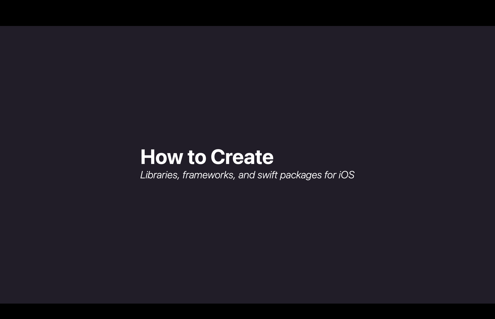
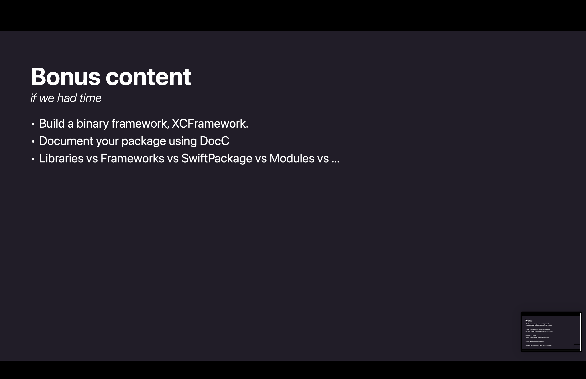
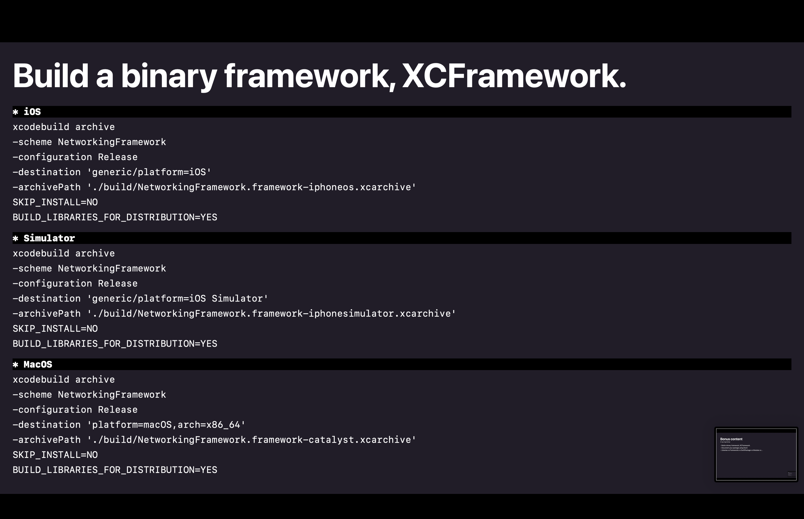
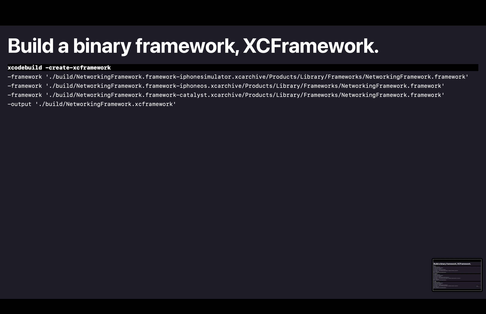
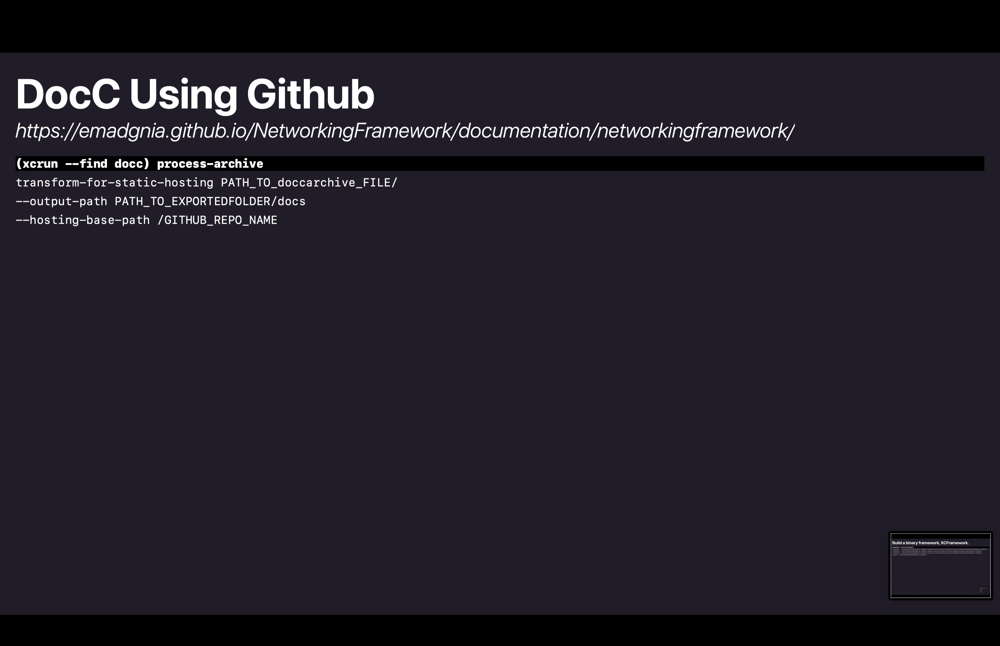
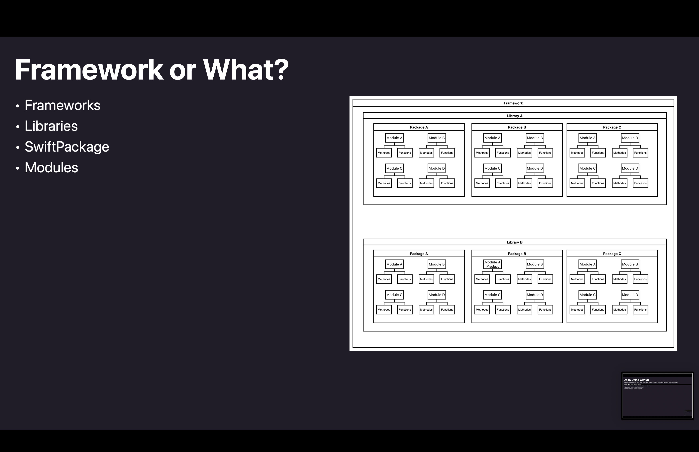

# tryswift-workshop-material

## Resources

- [StarCharles](https://github.com/Emadgnia/StarCharles)
- [ModelPackage](https://github.com/Emadgnia/ModelPackage)
- [NetworkingFramework](https://github.com/Emadgnia/NetworkingFramework)
- [NetworkingPackage](https://github.com/Emadgnia/NetworkingPackage)

## Slides

